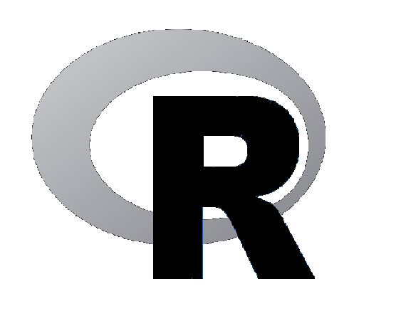

<!-- README.md is generated from README.Rmd. Please edit that file -->

# MagicEye

Super nascent project to create MagicEye-ish autostereogram based off
[this
paper](https://www2.cs.sfu.ca/CourseCentral/414/li/material/refs/SIRDS-Computer-94.pdf).

``` r
#install.packages("remotes")
remotes::install_github("ryantimpe/rstereogram")
```

### Warning

This package will likely give you a headache.

## Turn an image into a MagicEye

Convert small images in greyscale into 3D autostereograms. Darker colors
are closer to the viewer, while white and lighter shades are further
away.

<div style="width:200px">



</div>

``` r
demo_file <- system.file("extdata", "demo_r.png",
                         package = "rstereogram", mustWork = TRUE)
demo_image <- png::readPNG(demo_file)

library(rstereogram)
demo_image %>%
  image_to_magiceye() %>%
  plot()
```


Supply your own list of hex color codes with the `colors` input. You can
use as many colors as you’d like, but I’ve found the images are easier
to see with fewer, high contrast colors.

Alternatively, use `ggmagiceye()` instead of `plot()` to return a ggplot
object instead of a raster matrix.

``` r
demo_file <- system.file("extdata", "demo_pig.png",
                         package = "rstereogram", mustWork = TRUE)
demo_image <- png::readPNG(demo_file)

demo_image %>%
  image_to_magiceye(colors = c("#ffffff", "#111111", "#999922")) %>%
  ggmagiceye()
```


### Tips on how to see 3D images

  - [MagicEye.com](https://www.magiceye.com/avada_faq/help-how-do-i-see-in-3d/)
    tutorial

### Library of demo images

``` r
list.files("inst/extdata")
#> [1] "demo_circle.png"         "demo_hemi.png"          
#> [3] "demo_pig.png"            "demo_pig2.PNG"          
#> [5] "demo_r.png"              "demo_shapes.png"        
#> [7] "demo_stackedcircles.png" "demo_star.png"          
#> [9] "demo_triangles.png"
```

## 3D ggplots

Using the `ggplot_to_magiceye()` function, convert your chart object
into a MagicEye image.

``` r
df <- data.frame(
  group = c("Dog", "Cat", "Mouse"),
  value = c(25, 30, 50)
)

library(ggplot2)

ggplot(df, aes(x="", y=value, fill=group))+
  geom_bar(width = 1, stat = "identity") +
  coord_polar(theta="y") -> pp

pp
```


``` r
pp %>% 
  ggplot_to_magiceye(colors = c("#FF69B4", "#449999", "#010101")) %>% 
  plot()
```


## 3D Dinosaurs

Create a 3D dinosaur from a curated list of dinosaur (and some other
animal) UIDs from [phylopic.org](http://phylopic.org/) with the
[`rphylopic`](https://github.com/sckott/rphylopic) package.

``` r
dino_to_magiceye() %>% plot()
```


Specify an animal using it’s ID number. Easiest way to do this is to
grab the UID from the URL on phylopic.org, or use the API with
`rphylopic`.

``` r
my_phylo = "418abb75-3e4b-4533-a91c-2fbd03654501"

rphylopic::image_data(my_phylo, size = 128)[[1]] %>% 
  grDevices::as.raster() %>% plot
```


``` r
dino_to_magiceye(dino = my_phylo,
                 colors = c("#1f3d51", "#ddf5c2", "#FF3747")) %>% plot()
```


The 3D algorithm is still a big buggy and sometimes you will end up with
dinosaur with a few extra legs.
